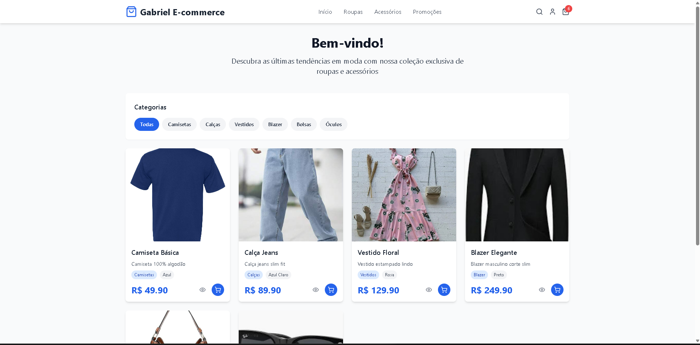
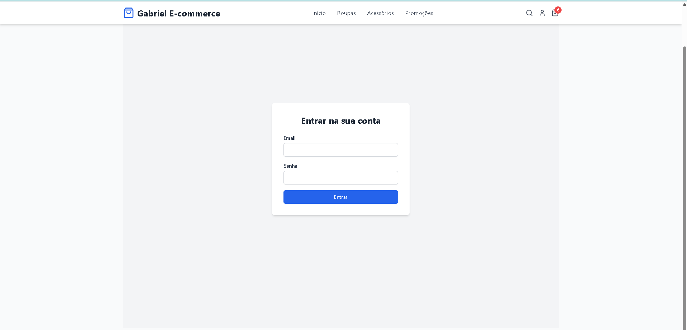

# 🛍️ E-commerce com React e TypeScript

Este é um projeto de front-end de e-commerce, desenvolvido com **React** e **TypeScript**, que demonstra a criação de um catálogo de produtos interativo com carrinho de compras. Ele foi arquitetado para ser modular e fácil de manter, aproveitando a tipagem estática do TypeScript e a velocidade de desenvolvimento do Vite.

### ✨ Funcionalidades Principais

O projeto inclui as seguintes funcionalidades:

* **Catálogo de Produtos:** Exibição dinâmica de uma lista de produtos.
* **Filtro por Categoria:** Capacidade de filtrar os produtos por categoria.
* **Carrinho de Compras:** Adicione, remova e ajuste a quantidade de itens no carrinho.
* **Busca:** Um campo de busca para encontrar produtos específicos.
* **Responsividade:** O layout é adaptável para diferentes tamanhos de tela.

### 🖼️ Visualização do Projeto

Abaixo estão algumas capturas de tela que ilustram as principais funcionalidades da aplicação:

#### Página Inicial

Exibindo o catálogo de produtos e opções de filtro.


#### Detalhes do Produto

Ao clicar em um produto, a aplicação pode exibir seus detalhes (simulado).


#### Busca de Produtos

A funcionalidade de busca permite filtrar produtos pelo termo digitado.


#### Carrinho de Compras

Adicione produtos ao carrinho e gerencie as quantidades.


#### Tela de Login

Página para autenticação de usuários.


### 💻 Tecnologias Utilizadas

O projeto é construído com as seguintes ferramentas e bibliotecas:

* **Vite**: Ferramenta de build que proporciona uma experiência de desenvolvimento extremamente rápida.
* **React**: Biblioteca para a criação da interface de usuário.
* **TypeScript**: Adiciona tipagem estática ao JavaScript, aumentando a robustez do código.
* **Tailwind CSS**: Framework de CSS para estilização rápida e flexível.
* **JSON**: Utilizado para armazenar dados dos produtos ou do carrinho localmente.
* **JavaScript**: Linguagem base do projeto, juntamente com TypeScript.
* **HTML**: Usado como a estrutura fundamental da página web.

### 🚀 Como Executar o Projeto

Para rodar este projeto na sua máquina local, siga os passos abaixo:

1.  **Clone o repositório:**
    ```bash
    git clone [https://github.com/GabrielVitorSZz/Sistema-de-E-commerce-de-roupas.git](https://github.com/GabrielVitorSZz/Sistema-de-E-commerce-de-roupas.git)
    ```
2.  **Acesse o diretório do projeto:**
    ```bash
    cd Sistema-de-E-commerce-de-roupas
    ```
3.  **Instale as dependências:**
    ```bash
    npm install
    # ou
    yarn
    ```
4.  **Inicie o servidor de desenvolvimento:**
    ```bash
    npm run dev
    # ou
    yarn dev
    ```
    O aplicativo estará disponível em `http://localhost:5173/` por padrão.

### 📁 Estrutura do Projeto

```plaintext
/
├── public/
├── src/
│   ├── components/       # Componentes React reutilizáveis
│   ├── hooks/            # Hooks customizados
│   ├── models/           # Classes e interfaces de dados
│   ├── pages/            # Componentes de página
│   ├── services/         # Camada de lógica de negócio e dados
│   ├── App.tsx           # Componente principal
│   ├── index.css         # Estilos globais
│   └── main.tsx          # Ponto de entrada da aplicação
├── .gitignore
├── package.json          # Dependências e scripts
├── tailwind.config.js    # Configuração do Tailwind
├── tsconfig.json         # Configuração do TypeScript
└── vite.config.ts        # Configuração do Vite
```

-----

**Passos para você:**

1.  **Copie todo o conteúdo** do `README.md` fornecido acima.
2.  No GitHub, **edite** seu `README.md` existente (clicando no ícone de lápis).
3.  **Cole o novo conteúdo**, substituindo o antigo.
4.  **Faça o commit** das mudanças.

Com isso, suas imagens deverão aparecer corretamente no README do seu repositório, tornando-o muito mais visual e explicativo\!
